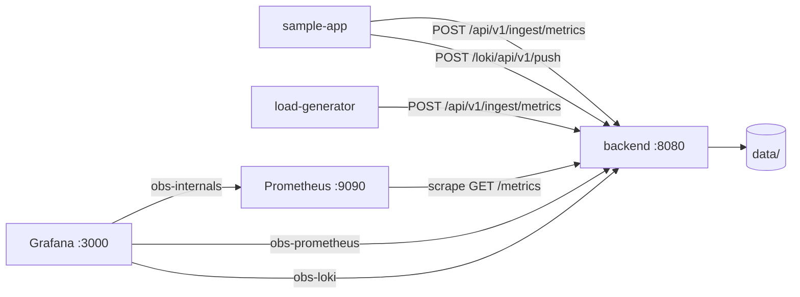
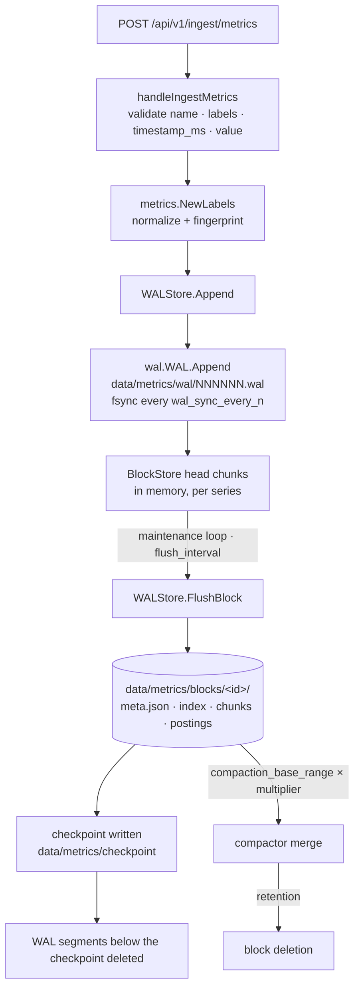
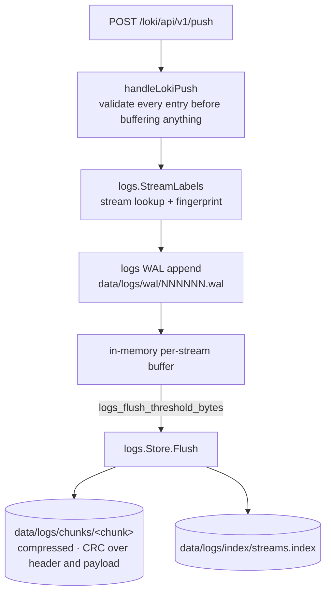
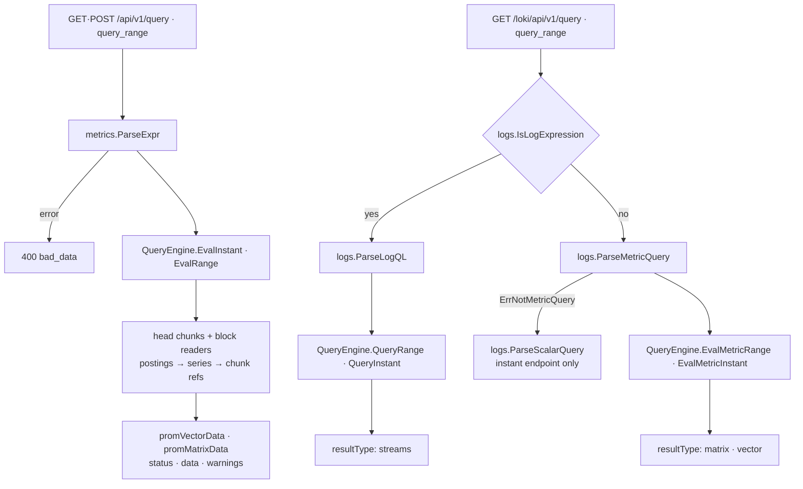

# Architecture

Four views of the same system: what talks to what, how a metric gets to disk, how
a log line gets to disk, and how a query gets answered.

Every node below names a real symbol, file, or route. A diagram of generic boxes
cannot be checked against the tree and ages into decoration; one that names
`FlushBlock` and `streams.index` can be followed into the code.

On-disk detail lives in [storage-layout.md](storage-layout.md). The query forms
these paths accept are in [../api/limitations.md](../api/limitations.md).

## System context

One Go process speaks both the Prometheus subset and the Loki subset, over one
port, backed by two separate storage subtrees.

Grafana has three datasources and two of them are Prometheus-shaped, which is
deliberate. `obs-prometheus` reaches the backend's own TSDB, holding what the
producers push. `obs-internals` reaches a **separate Prometheus** that scrapes the
backend's `/metrics`, holding telemetry *about* the backend. Telemetry that shares
fate and storage with the workload it observes goes blind exactly when that
storage breaks — a WAL problem would corrupt the evidence of the WAL problem.

## Metrics write path

**WAL before buffer** is the durability contract. A sample is acknowledged only
once it is in the write-ahead log, so a `204` means a crash loses nothing the
caller was told had been stored. The in-memory head chunks exist for query speed,
never as the system of record.

**The checkpoint is what makes WAL truncation safe.** Segments are deleted only
after the samples they carry are durable in an immutable block. Without it, the
choice would be between an unbounded WAL and a window where data exists in
neither place.

Compaction merges small blocks into larger ones and rebuilds their index. It never
reduces resolution — there is no downsampling, so storage grows with raw sample
count until retention deletes whole blocks.

## Logs write path

The shape mirrors the metrics path — fingerprint, WAL, buffer, flush, index — with
one deliberate difference: **validation is all-or-nothing**. Every entry in a push
is checked before anything is buffered, so a request containing one bad line
stores none of them. A partially-applied push can never be mistaken for a complete
one, which matters because the sender has no way to ask which lines survived.

Log chunks are compressed and carry a CRC over both header and payload, so a
truncated or corrupted chunk is detected on read rather than served as plausible
log lines.

## Query path

**Parsing is the compatibility boundary.** Everything the platform claims to
support is decided in `metrics.ParseExpr` and in the Loki dispatch, before any
storage is touched. Anything outside the subset fails there with an explicit
`400` — which is why the Loki `interval` parameter is rejected rather than
ignored, and why a structured-metadata log entry is rejected rather than
silently stripped.

The Loki side dispatches on the expression before reading any time parameter, so a
malformed query reports the query error rather than a confusing time error. An
expression opening with `{` is a log selector; anything else is a metric query, or
a constant expression such as `vector(1)` which is answerable only on the instant
endpoint.

Reads merge in-memory head chunks with on-disk blocks, so a query spanning a flush
boundary sees one continuous series rather than a gap.
