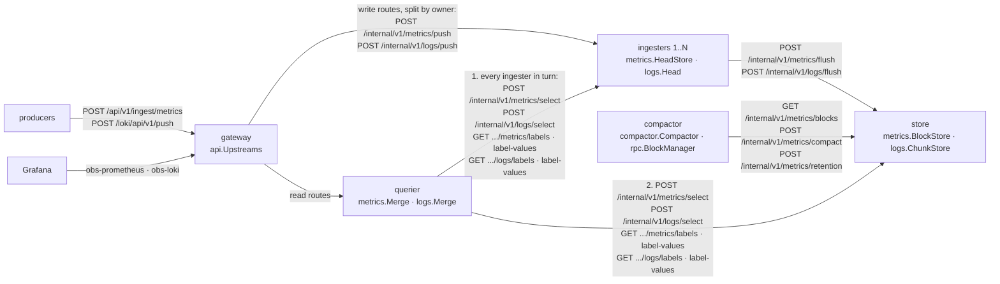
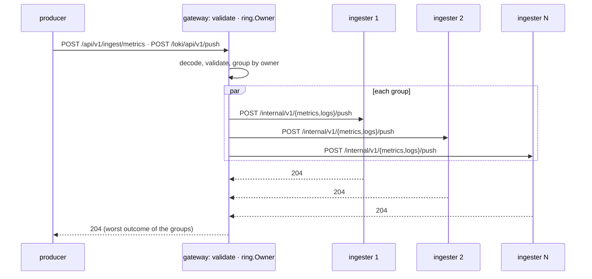
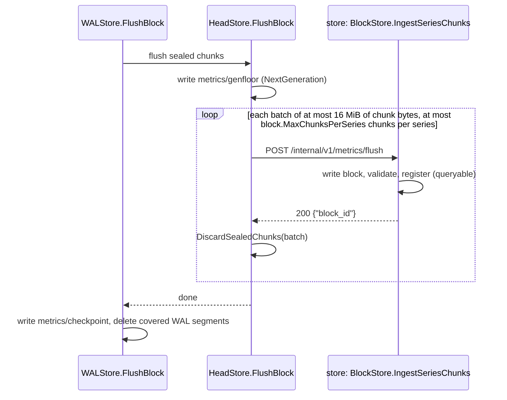
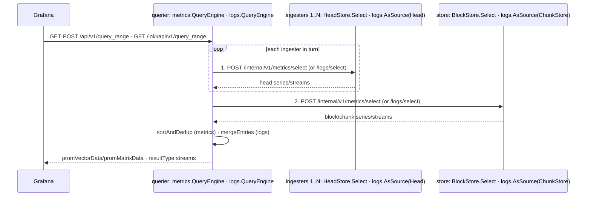

# Components

The backend runs as one process (`OBS_TARGET=all-in-one`, the default) or as
five (`gateway`, `ingester`, `querier`, `store`, `compactor`). It is one binary
either way; the target decides what a process serves, runs, and owns. This page
is the split topology's reference: what each component does, which data it
owns, how data moves between them, and what happens when one is down.

The all-in-one process is the same components assembled in-process — same
routes, same on-disk layout, same single maintenance loop — so everything in
[README.md](README.md) describes it unchanged.

## Responsibilities and ownership

| Target | Serves | Background work | Owns on disk | Calls |
|---|---|---|---|---|
| `all-in-one` | every public route | flush → compact → retain | the whole data directory | — |
| `gateway` | every public route; the two write routes are validated and routed, the read routes proxied | — | — | every ingester, querier |
| `ingester` | the two public write routes, the two internal push routes; internal head reads | metrics flush loop; logs threshold flush | `metrics/wal`, `metrics/checkpoint`, `metrics/genfloor`, `logs/wal` | store |
| `querier` | the nine read routes | — | — | every ingester, store |
| `store` | internal only: flush-in, reads, block maintenance | — | `metrics/blocks`, `metrics/tmp`, `logs/chunks`, `logs/index` | — |
| `compactor` | — | compact → retain | — | store |

Every durable directory has exactly one owning process, so no volume is shared
between components and no process ever reasons about another mutating a
directory under it. Peers are named by `OBS_INGESTER_URL` (a comma-separated
list on the gateway and querier, see [The ring](#the-ring)), `OBS_STORE_URL`,
and `OBS_QUERIER_URL`; a target refuses to start if one it needs is missing or one
it does not use is set. The internal API is described in
[../api/internal.md](../api/internal.md); it carries no authentication,
matching the public API (see [../api/limitations.md](../api/limitations.md)),
and is reachable in Kubernetes only through ClusterIP Services.



## The ring

The gateway and the querier take `OBS_INGESTER_URL` as a comma-separated list;
each URL is a ring member, identified by the URL with any trailing `/` trimmed.
The list is refused if an element is empty or repeats another after that
normalization. One URL is a one-member ring and behaves as the single ingester
did before. `OBS_STORE_URL` and `OBS_QUERIER_URL` stay single URLs.

`internal/ring` is a token ring with no I/O: each member gets 128 tokens on a
64-bit ring, and a key belongs to the member of the first token at or past its
mixed hash, wrapping at the top. The ring is a function of the member *set*, so
list order does not matter. The key is the series fingerprint for metrics
(over the full label set including `__name__`, routed per sample) and the
stream fingerprint for logs (routed per stream, so one stream's entries in a
push go to one ingester). Adding or removing a member moves only the keys that
member gains or loses.

At startup the gateway and the querier each log `ring ready` with
`members=N ring=<8 hex chars>`, the hash of the sorted member list. Equal
hashes mean the same member set; compare them whenever writes seem to
disappear.

### Write path

The gateway no longer proxies the two write routes. It decodes and validates
the body with the same code all-in-one and an ingester's public routes run, so
every topology refuses the same input with the same `400` body and counts it in
`obs_samples_rejected_total` or `obs_log_lines_rejected_total`. It then groups
samples and streams by owner and sends each group to its ingester concurrently
over `POST /internal/v1/metrics/push` or `/logs/push`
([../api/internal.md](../api/internal.md)), each carrying the inbound
`X-Request-Id`. The answer is the worst outcome among the groups:

| Outcome | Status |
|---|---|
| every group answered `204` | `204` |
| a transport error, a deadline, or a `5xx` | `503` `{"error":"ingester unavailable"}` |
| a `4xx` from an ingester | `500` `{"error":"internal error"}`, logged at ERROR: the gateway validated the body, so the two disagree about the protocol |
| the client went away | `499`, and outstanding sends are canceled |

When groups differ, `500` outranks `503`, which outranks `499`. A `503` can
leave some groups written. Retrying the whole batch is safe: a metrics retry
rewrites the same values at the same timestamps, and reads already collapse
duplicate log entries by `(timestamp, line)`.



An ingester validates a push again and answers `400` for a malformed body or
`500` if the append fails. It counts only an append failure as a rejection
(reason `append`), because the gateway already counted the validation
rejections. It does not check that it owns the keys it is
sent: a write sent to the wrong ingester is still read, because every read
covers every member.

### Read path

See [Reads](#reads-and-why-a-flush-is-invisible-to-them): the querier reads
every ingester in turn, then the store.

### Membership changes

Membership is static; a change takes a restart of the gateway and the querier.

- **Adding an ingester:** start it, then restart the gateway and querier with
  the longer list. About 1/N of series and streams route to the new member from
  then on. Their older data stays on the previous owner until that ingester
  flushes it; every read covers both, and generations order any overlap.
- **Removing an ingester:** stop it first (its shutdown runs the final flush),
  then restart the gateway and querier without it. Anything a failed final
  flush left behind stays in that ingester's WAL and is not read until it
  rejoins ([../api/limitations.md](../api/limitations.md)).
- The gateway's and querier's lists must match. Helm renders both from one
  helper (`backend.ingesterURLs`); in Compose the two literal lists are edited
  by hand and must be kept identical, and the `ring` hash in the two `ring
  ready` startup lines confirms it. A gateway writing to a member the querier does not read
  hides those writes.

### Generations

Last-write-wins between two samples at one timestamp is decided by write
generation. Each ingester assigns `gen = max(previous + 1, now in Unix µs)`, in
every target including all-in-one. That is strictly increasing on one ingester
(the persisted `genfloor` keeps it so across a restart, even if the clock steps
back) and comparable across ingesters up to their clock skew, so a write
accepted later on any ingester outranks an earlier one. Counter-era
generations are small, so new writes outrank them without a migration.

The generation is assigned before the WAL write and recorded in WAL record
type `0x02` (the type-1 body plus 8 bytes of generation). Replay restores it
exactly and raises the floor past it, so an ingester replaying an old write
cannot outrank a newer write another ingester took. A type-1 record, written
before the ring, replays with a fresh generation as it always did.

The cost is chunk size: per-sample generations are stored as varint deltas, and
a µs delta is larger than a counter's. Measured for a 120-sample chunk at a
15 s interval: 4.64 bytes per sample with the old counter and 5.63 with µs
generations, 0.99 more.

## The flush



The generation floor is written first because last-write-wins between two
samples at one timestamp is decided by write generation, and the blocks that
would otherwise seed the ingester's counter live in another process. With the
floor persisted before anything is sent, no block the ingester ever ships can
outrank a write it accepts after a restart.

A batch also never carries more than `block.MaxChunksPerSeries` chunks for any
one series, split across batches if a series' backlog is larger: `store`'s
block reader (`block.OpenReader`) refuses a block whose index declares more
chunks than that for a series, and it only discovers that after the store has
already written and fsynced it. The store then deletes that rejected block and
answers with an error (`BlockStore.ingestLocked`'s `OpenReader` branch), so no
data is lost — the ingester keeps its chunks and retries — but without the cap
every retry of an over-limit series would fail the same way and that series'
flush would wedge for good. The ingester enforces the cap before sending so
that failure mode never happens.

`BlockStore.IngestSeriesChunks` refuses malformed input — zero series, a
duplicate series ID, a series with no chunks, an empty chunk, or a label set
that does not fingerprint to its claimed ID — with `ErrInvalidSeriesChunks`,
which the store's flush-in handler answers as `400`; any other failure is
`500`.

The logs head (`Head.flushLocked`) flushes similarly — batched requests to the
same sink seam — but differs in three ways:

- it holds its lock from snapshot to reset and drops nothing from memory until
  *every* batch in the flush has been acknowledged, not batch-by-batch like the
  metrics head: `LogWAL.Checkpoint` deletes every segment, so the checkpoint
  (and the head reset) is only correct once the whole flush has landed;
- a failure part-way through therefore leaves the whole head intact, so the
  next attempt resends batches the store already holds — those duplicates are
  absorbed by the `(timestamp, line)` dedup a read applies, the same dedup
  that already covers the crash window between a chunk write and its
  checkpoint;
- it has no generation floor: logs entries never need one, since ordering
  between head and persisted entries is fixed (persisted ahead of head at an
  equal timestamp) rather than resolved by a write generation.

Its batches are sized by estimated wire bytes — the JSON an `IngestStreams`
call would encode, not raw log-line bytes — so a batch of highly-escaped lines
still lands under the store's body limit. In the ingester a failed logs flush
does not fail the push that triggered it — the entry is already in the WAL —
and flushes pause for 30 s.

## Reads, and why a flush is invisible to them

The querier reads through `Merge(MergeHeads(ingesters...), store)` for each
signal (`metrics.MergeHeads` and `logs.MergeHeads` fold the existing `Merge`
over the ring's members; one member is that member itself). Each source is read
to completion before the next starts, never two at once: every ingester in
turn, then the store.

1. the store registers a flushed block before it acknowledges the flush;
2. an ingester discards those chunks only after the acknowledgement;
3. the querier finishes reading every ingester before it starts on the store.



A sample missing from every ingester's answer was therefore discarded before
that read began, so the store had it before its read began. Overlap between the
answers is resolved per signal, by the same rule the equivalent all-in-one path
already applies between its own head and persisted data — one rule per signal,
not two, shared by all-in-one and split:

- metric samples merge by `(timestamp, highest generation)` through
  `sortAndDedup` — the function `metrics.Merge` calls and `BlockStore` itself
  uses between its head and its blocks;
- log entries dedup by `(timestamp, line)`, persisted ahead of head at an equal
  timestamp, through `mergeEntries` — the function `logs.Merge` calls and the
  one `logs.Store.StreamEntries` uses between its head and its chunk store in
  all-in-one.

## Compaction

The compactor owns the policy — planning with `compactor.Plan`, the cadence,
the retention clock, and the maintenance metrics. The store owns the mechanism:
`rpc.BlockManager.CompactOnce` lists the store's blocks, plans locally, and
posts the chosen groups; the store re-checks that each group's blocks still
exist and runs `BlockStore.CompactOnce` with every integrity check it has
always run. That runs under `flushMu` end to end — the same lock
`IngestSeriesChunks` takes, so a flush and a compaction never race on the block
set — and takes the readers' `bs.mu` only briefly, for the swap that installs
the merged block and retires its sources; every read against `bs.mu` sees
either the pre-compaction or the post-compaction set, never a partial one.

```mermaid
sequenceDiagram
  participant C as compactor.Compactor
  participant B as rpc.BlockManager
  participant S as store: BlockStore.CompactOnce
  C->>B: CompactOnce(compactor.Plan)
  B->>S: GET /internal/v1/metrics/blocks
  S-->>B: block list
  B->>B: compactor.Plan(blocks)
  B->>S: POST /internal/v1/metrics/compact {groups}
  S->>S: re-check each group's blocks still exist
  S->>S: BlockStore.CompactOnce (flushMu end to end; bs.mu only for the swap)
  S-->>B: 200 {"compacted": n}
  C->>B: ApplyRetention(now, retention)
  B->>S: POST /internal/v1/metrics/retention
  S-->>B: 200 {"deleted": n}
```

## When a component is down

| Down | Writes | Reads and metadata | Background work |
|---|---|---|---|
| store | accepted: WAL + head; the head grows | `503` `unavailable` | flushes and compaction passes fail, are counted, and retry |
| one ingester | `503` at the gateway for any batch with a key it owns; other batches succeed | `503` at the querier | — |
| querier | unaffected | `503` at the gateway | — |
| compactor | unaffected | unaffected | no compaction or retention until it returns |

Reads fail closed: a query never answers from some sources while another is
down, because a partial answer would look complete. Readiness reports only a
process's own state — its data directory, for the ingester and store — so one
component's outage never marks its dependents unready.

A peer outage or a deadline (`rpc.ErrUnavailable`, including a wrapped
`context.DeadlineExceeded`) answers `503`; a caller that leaves before a query
finishes answers `499` `canceled` instead — Grafana abandoning a dashboard
refresh or zoom is not a server error, and counting it as one would inflate the
self-observability dashboard's error rate for something that never failed. The
gateway applies the same rule to a client that disconnects mid-proxy: `499`,
not `503`.

## Observability

Each component exports only the metrics for work it does. The gateway and the
querier export `obs_ring_members`, the size of the ring they route over or
read. The gateway also exports `obs_gateway_ingester_requests_total{ingester,
outcome}`, the write groups it sent to each ingester (`ingester` is the
member's host:port; `outcome` is `ok`, `unavailable`, or `error`), and, since
validation now runs there, the ingest rejection counters. Each ingester counts
the samples and lines it ingested, which shows how evenly the ring spreads
writes. Every scrape target
carries a `component` label; the internals dashboard counts HTTP only at the
edge (`all-in-one` or `gateway`) and plots `up` by component. Every log line
carries `target=<mode>`, and one `X-Request-Id` follows a request from the
gateway through the querier to the ingester and store.

## Deploying it

- Compose: [../runbooks/split-demo.md](../runbooks/split-demo.md), from
  `deployments/docker/docker-compose.split.yml`, with three ingesters
  (`ingester-1` to `ingester-3`). The ingesters and store get a
  60 s `stop_grace_period` there, long enough for a graceful stop to finish an
  in-flight flush instead of being killed mid-write.
- Kubernetes: the backend chart's `topology: split`; see
  [../../deployments/helm/README.md](../../deployments/helm/README.md), with
  `split.ingester.replicas` ingesters (default 3). The
  ingester and store StatefulSets set `terminationGracePeriodSeconds: 60` for
  the same reason.
